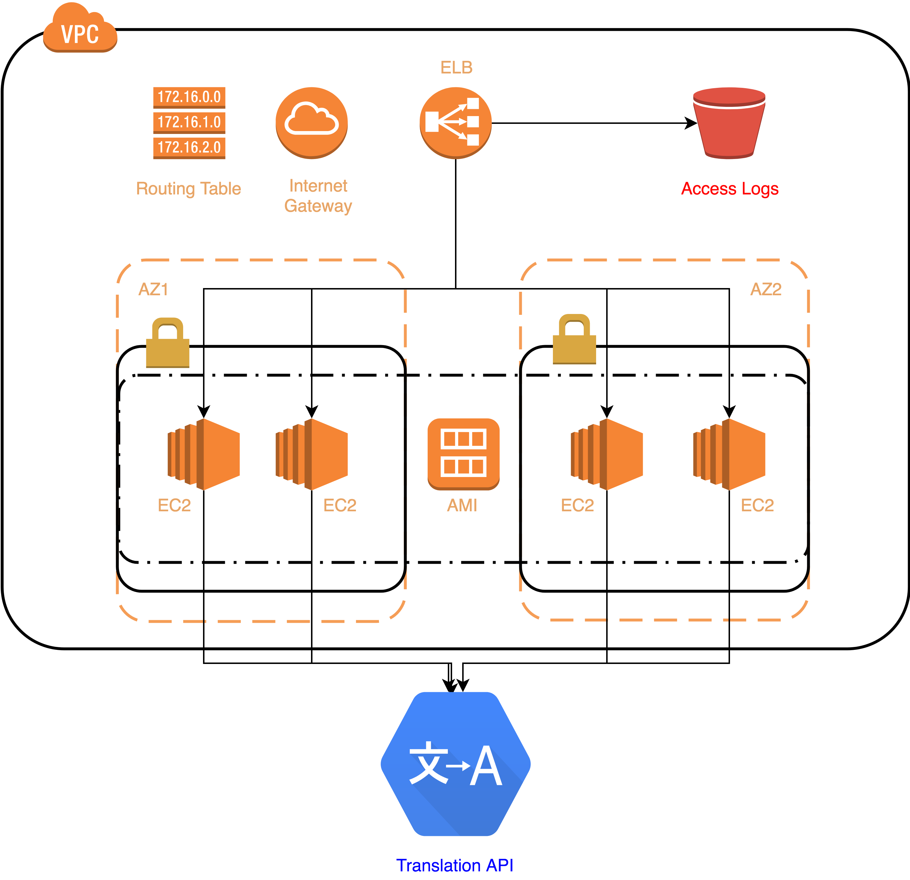

# Google Translator

Intermadiate application for translating texts based on AWS infrastructure using Google translation API.

This project is used as a preparation for AWS Certified Solution Architect exam. More in doc folder.

**Technologies**
- Kotlin, Spring Boot, Swagger
- Google Translation API
- Full AWS infrastructure
- Packer with Ansible for AMI building
- Jenkins Pipeline script

**Building and starting locally**
1. Build

        mvn clean install

2. Start application

        mvn clean spring-boot:run

3. Go to

        http://localhost:8090
        
**Creating infrastructure and deploying in AWS cloud**
1. Use Jenkins

        cd/Jenkinsfile
